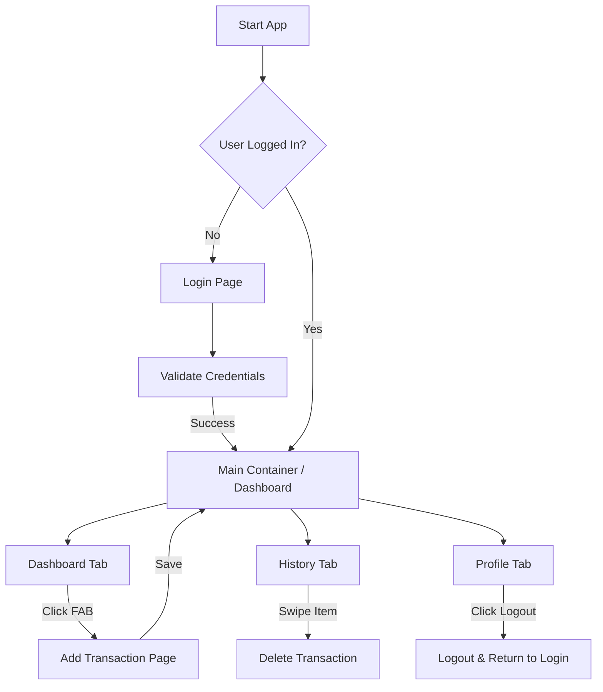

# MoneyTrail - Mobile Application Proposal

## a) Group Members
| Name | Matric Number |
| :--- | :--- | :--- |
| **Firdaus Muhammad Salman** | 2223281 |
| [Member 2 Name] | [Matric No] |
| [Member 3 Name] | [Matric No] |

## b) Project Title
**MoneyTrail: Simple Budget Tracker**

---

## c) Introduction
**Problem:** Many students and young professionals struggle to keep track of their daily expenses. Complex financial apps often have steep learning curves and too many unnecessary features, leading to user abandonment.

**Motivation:** We want to build a "frictionless" tracking experience. The goal is to allow users to record a transaction in under 5 seconds.

**Relevance:** Financial literacy starts with awareness. By providing a straightforward tool for tracking income versus expenses, users can make better financial decisions and manage their monthly budgets effectively.

---

## d) Objectives
1. To develop a cross-platform mobile application using Flutter for tracking personal finances.
2. To provide a clear visualization of the user's current balance and recent transaction history.
3. To implement a secure authentication system for user data privacy.
4. To enable CRUD (Create, Read, Update, Delete) functionality for daily transactions.

---

## e) Target Users
* **University Students:** Who need to manage limited allowances/loans (PTPTN).
* **Young Professionals:** Who are just starting to manage their own salaries.
* **Gig Workers:** Who need to track irregular income streams and daily expenses.

---

## f) Features and Functionalities

### Core Modules
1.  **Authentication:** Secure Login/Logout (Mock implementation currently, moving to Firebase Auth).
2.  **Dashboard:** Real-time view of Total Balance and the 5 most recent transactions.
3.  **Transaction Management:** * Add new Income or Expense.
    * Categorize transactions (Title/Type).
    * Delete erroneous entries.
4.  **History Log:** Scrollable list of all past transactions.

### UI Components
* **Bottom Navigation Bar:** For seamless switching between Dashboard, History, and Profile.
* **Floating Action Button (FAB):** Quick access to add new transactions.
* **Cards & ListTiles:** For displaying transaction details cleanly.
* **Snackbar:** For user feedback (e.g., validation errors).

---

## g) Proposed UI Mock-up
*> Note: Please refer to the `screenshots` folder for actual screen captures.*

### 1. Login & Dashboard
 
*(Replace this path with your actual uploaded screenshot)*

### 2. Add Transaction & History

*(Replace this path with your actual uploaded screenshot)*

---

## h) Architecture / Technical Design

### Component Structure
The app follows a standard Flutter composition pattern:
* **`MyApp` (Root):** Handles routing and theming (`Material3`, `Colors.indigo`).
* **`MainContainerPage`:** Acts as the shell for the application, maintaining the `BottomNavigationBar` state.
* **Feature Widgets:** `DashboardPage`, `HistoryPage`, `AddTransactionPage`, `ProfilePage`.

### State Management
* **Current Prototype:** We are currently using `setState` for local widget UI updates and a **Singleton Pattern (`DataStore`)** to mock a global database and share state between pages.
* **Final Implementation:** We plan to migrate to **Riverpod** or **Provider** for more robust state management to handle asynchronous Firebase streams and separate business logic from UI code.

---

## i) Data Model

### Entity: Transaction
The core data entity is the `TransactionItem`.

| Field | Type | Description |
| :--- | :--- | :--- |
| `id` | String | Unique Identifier (UUID/Timestamp) |
| `title` | String | Description of the transaction |
| `amount` | Double | The monetary value |
| `isExpense` | Boolean | `true` = Expense, `false` = Income |
| `date` | DateTime | Timestamp of creation |

### Proposed Database Model (Firestore)
We will use a Collection-Document structure in Firebase:

* **Collection:** `users`
    * **Document:** `uid` (User's ID)
        * **Sub-collection:** `transactions`
            * **Document:** `transaction_id`
                * `title`: "Lunch"
                * `amount`: 15.50
                * `type`: "expense"
                * `created_at`: Timestamp

---

## j) Flowchart / User Interaction

### Next Steps for you:
1.  **Copy** the code above into a file named `README.md` in your GitHub repository.
2.  **Take Screenshots:** Run your provided code in an emulator, take screenshots of the Login, Dashboard, and Add Transaction screens, and upload them to your repo. Replace the `` lines with the actual image links (e.g., ``).
3.  **Fill in Members:** Don't forget to update the table in section (a) with your actual group details.
