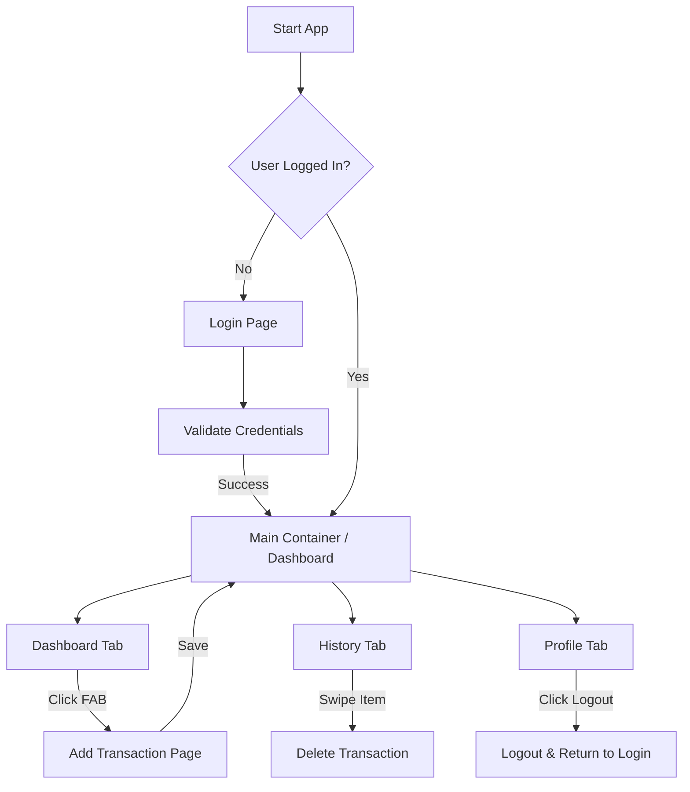

# MoneyTrail - Mobile Application Proposal

## a) Group Members
| Name | Matric Number |
| :--- | :--- |
| Firdaus Muhammad Salman | 2223281 |
| Siti Hajar 'Aainaa Binti Hamid | 2218648 |
| Muhammad Aqil bin Suhazi Reza | 2222987 |

## b) Project Title
**MoneyTrail: A Personal Budget Tracking Mobile Application**

---

## c) Introduction
Managing personal finances is a common challenge, especially among students and young adults who often struggle to track daily expenses, control spending habits, and plan savings effectively. Many individuals still rely on manual methods or fragmented tools, which can be time-consuming and prone to errors. As a result, users may lose awareness of where their money is being spent, leading to poor financial decisions and financial stress.

MoneyTrail is a mobile budget tracker application designed to help users monitor their income and expenses in a simple, organised, and user-friendly manner. The application is motivated by the growing need for financial awareness and discipline in daily life. By providing clear insights through categorised expenses, summaries, and visual indicators, MoneyTrail aims to support better financial planning and responsible money management.

---

## d) Objectives
1. To help users record and track daily income and expenses efficiently.
2. To enable users to categorise expenses for better spending analysis.
3. To provide a clear overview of monthly budgets and remaining balances.
4. To increase users’ awareness of their spending patterns.
5. To support better financial planning and savings habits.

---

## e) Target Users
* University and college students managing limited allowances.
* Young professionals who want to track personal expenses.
* Individuals seeking a simple and lightweight budget tracking solution.
* Users with basic financial literacy who prefer an easy-to-use mobile app.

---

## f) Summary of Achieved Features

### Core Modules
1.  **Authentication:** Secure Login and Signup using **Firebase Authentication**.
2.  **Dashboard:** Real-time view of Total Balance and recent transactions.
3.  **Transaction Management:**
    *   Add new Income or Expense with custom categories.
    *   **Receipts:** Upload and view images (receipts) for transactions (stored in **Firebase Storage**).
    *   **Edit/Delete:** Modify or remove existing transactions.
4.  **History & Analytics:**
    *   Scrollable list of all past transactions.
    *   **Filters:** Filter transactions by **Month** and **Category** for better analysis.
5.  **Personalization:**
    *   **Theme Support:** Fully functional **Dark Mode** and Light Mode.

### UI Components
*   **Bottom Navigation Bar:** Seamless switching between Dashboard, History, and Profile.
*   **Material Design 3:** Modern UI with consistent theming.

---

## g) Proposed UI Mock-up
*> Note: Please refer to the `prototype/` folder for the actual high-resolution screen captures.*

### 1. Authentication & Dashboard
This section describes the user entry points (Login and Signup) as well as the main landing screen of the application, which presents an overview of the user’s current money flow, visualized through financial charts, along with a summary of recent activities.

| Login & Signup Screen | Homepage / Dashboard |
| :---: | :---: |
|   |  |

### 2. Core Features (Transactions)
Users can efficiently add new transactions, whether expenses or income. Expenses can be organized into customizable categories, allowing users to tailor the system to their needs. Through these interfaces, users can review their complete transaction history and apply filters to view past transactions based on their preferred time period.

| Add Transaction | Transaction History |
| :---: | :---: |
|   |  |

### 3. Account Management
The user profile screen allows for personal data management and application settings.

| User Profile |
| :---: |
|  |

---

## h) Technical Explanation

### Architecture & Tech Stack
The application is built using **Flutter** and follows a modern, scalable architecture.

*   **Framework:** Flutter (Dart)
*   **State Management:** **Riverpod** is used for robust and testable state management, handling asynchronous data streams and global app state (e.g., User, Theme).
*   **Routing:** **GoRouter** for declarative and deep-linkable navigation.

### Backend (Firebase)
*   **Firebase Authentication:** Handles secure user onboarding and session management.
*   **Cloud Firestore:** A NoSQL cloud database used to store:
    *   User profiles
    *   Transaction records (real-time synchronization)
*   **Firebase Storage:** Used for storing transaction receipt images.

### Folder Structure
*   `lib/views`: UI screens (Dashboard, History, Add Transaction, etc.).
*   `lib/services`: Business logic and external API calls (Auth, Firestore, PDF).
*   `lib/provider`: Riverpod providers for state management.
*   `lib/models`: Data models (TransactionItem, etc.).
  
---

## i) Data Model

### Entity: Transaction
The core data entity is the `TransactionItem`.

| Field | Type | Description |
| :--- | :--- | :--- |
| `id` | String | Unique Identifier (UUID/Timestamp) |
| `title` | String | Description of the transaction |
| `amount` | Double | The monetary value |
| `isExpense` | Boolean | `true` = Expense, `false` = Income |
| `date` | DateTime | Timestamp of creation |

### Proposed Database Model (Firestore)
We will use a Collection-Document structure in Firebase:

* **Collection:** `users`
    * **Document:** `uid` (User's ID)
        * **String** `name`
        * **String** `email`
        * **Sub-collection:** `transactions`
            * **Document:** `transaction_id`
                * `title`: "Lunch"
                * `amount`: 15.50
                * `type`: "expense"
                * `created_at`: Timestamp
### Design Rationale:
* User data is isolated per uid
* Transactions are scoped to each user
* Supports scalability and secure access rules
* Compatible with Firebase Authentication integration
---

## j) Flowchart / User Interaction

### Interaction Summary
* Users must authenticate before accessing core features
* Navigation is controlled via the Bottom Navigation Bar
* Transactions can be added from anywhere using the FAB
* Logout clears session and returns the user to the login screen

## K) Limitations and Future Enhancements

### Limitations
*   **Manual Data Entry:** The app currently relies on manual input for all transactions; there is no automatic bank synchronization or SMS parsing.
*   **PDF Export:** The PDF export functionality for transaction history is currently disabled/under development.

### Future Enhancements
*   **Budget Alerts:** Implement push notifications to warn users when they exceed defined budget limits.
*   **Data Export:** Enable users to export their transaction history as PDF or CSV files.
*   **Advanced Analytics:** Add charts and graphs for monthly spending comparisons and trend analysis.
*   **Multi-user Support:** Allow shared budgets for managing family or group finances.

## L) References & Documentation

This project is built using the **Flutter** framework and **Firebase** services. For further information on the technologies used, refer to the following official documentation:

### Flutter Core
* **[Flutter Documentation](https://docs.flutter.dev/):** The primary source for Flutter development, including widgets, state management, and navigation.
* **[Dart Language Guide](https://dart.dev/guides):** Detailed documentation on the Dart programming language.

### Firebase Integration
* **[Firebase for Flutter Guide](https://firebase.google.com/docs/flutter/setup):** Official guide on connecting Flutter apps to Firebase projects.
* **[Cloud Firestore](https://firebase.google.com/docs/firestore):** Documentation for the NoSQL database used for real-time data storage.
* **[Firebase Authentication](https://firebase.google.com/docs/auth):** Implementation details for user login and security.

### Tools & Packages
* **[Pub.dev](https://pub.dev/):** The official package repository for Dart and Flutter (used for searching plugins like `firebase_core`, `cloud_firestore`, etc.).

---
