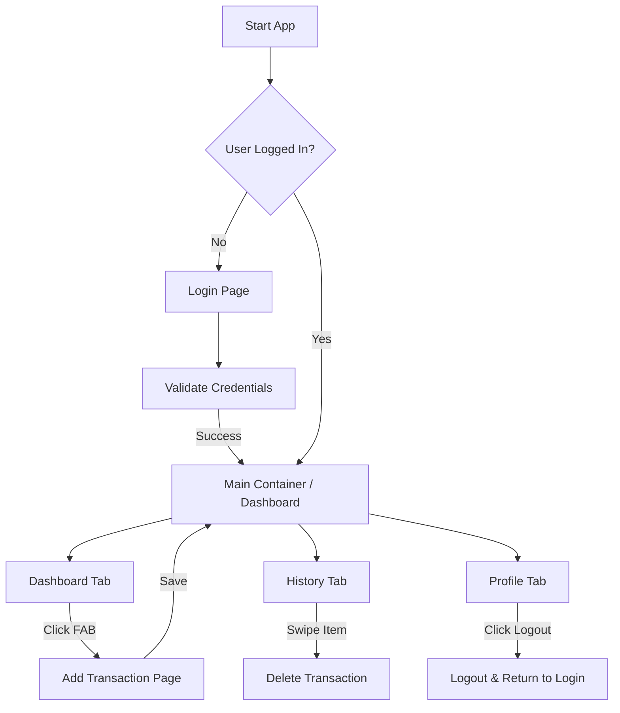

# MoneyTrail - Mobile Application Proposal

## a) Group Members
| Name | Matric Number |
| :--- | :--- |
| **Firdaus Muhammad Salman** | 2223281 |
| Siti Hajar 'Aainaa Binti Hamid | 2218648 |
| Muhammad Aqil bin Suhazi Reza | 2222987 |

## b) Project Title
**MoneyTrail: A Personal Budget Tracking Mobile Application**

---

## c) Introduction
Managing personal finances is a common challenge, especially among students and young adults who often struggle to track daily expenses, control spending habits, and plan savings effectively. Many individuals still rely on manual methods or fragmented tools, which can be time-consuming and prone to errors. As a result, users may lose awareness of where their money is being spent, leading to poor financial decisions and financial stress.

MoneyTrail is a mobile budget tracker application designed to help users monitor their income and expenses in a simple, organised, and user-friendly manner. The application is motivated by the growing need for financial awareness and discipline in daily life. By providing clear insights through categorised expenses, summaries, and visual indicators, MoneyTrail aims to support better financial planning and responsible money management.

---

## d) Objectives
1. To help users record and track daily income and expenses efficiently.
2. To enable users to categorise expenses for better spending analysis.
3. To provide a clear overview of monthly budgets and remaining balances.
4. To increase users’ awareness of their spending patterns.
5. To support better financial planning and savings habits.

---

## e) Target Users
* University and college students managing limited allowances.
* Young professionals who want to track personal expenses.
* Individuals seeking a simple and lightweight budget tracking solution.
* Users with basic financial literacy who prefer an easy-to-use mobile app.

---

## f) Features and Functionalities

### Core Modules
1.  **Authentication:** Secure Login/Logout (Mock implementation currently, moving to Firebase Auth).
2.  **Dashboard:** Real-time view of Total Balance and the 5 most recent transactions.
3.  **Transaction Management:** * Add new Income or Expense.
    * Categorize transactions (Title/Type).
    * Delete erroneous entries.
4.  **History Log:** Scrollable list of all past transactions.

### UI Components
* **Bottom Navigation Bar:** For seamless switching between Dashboard, History, and Profile.
* **Floating Action Button (FAB):** Quick access to add new transactions.
* **Cards & ListTiles:** For displaying transaction details cleanly.
* **Snackbar:** For user feedback (e.g., validation errors).

---

## g) Proposed UI Mock-up
*> Note: Please refer to the `prototype/` folder for the actual high-resolution screen captures.*

### 1. Authentication & Dashboard
This section describes the user entry points (Login and Signup) as well as the main landing screen of the application, which presents an overview of the user’s current money flow, visualized through financial charts, along with a summary of recent activities.

| Login & Signup Screen | Homepage / Dashboard |
| :---: | :---: |
|   |  |

### 2. Core Features (Transactions)
Users can efficiently add new transactions, whether expenses or income. Expenses can be organized into customizable categories, allowing users to tailor the system to their needs and user also can upload tey receipt. Through these interfaces, users can review their complete transaction history and apply filters to view past transactions based on their preferred time period.

| Add Transaction | Transaction History |
| :---: | :---: |
|  |  |

### 3. Account Management
The user profile screen allows for personal data management and application settings.

| User Profile |
| :---: |
|  |

---

## h) Architecture / Technical Design

### Component Structure
The app follows a standard Flutter composition pattern:
* **`MyApp` (Root):** Handles routing and theming (`Material3`, `Colors.indigo`).
* **`MainContainerPage`:** Acts as the shell for the application, maintaining the `BottomNavigationBar` state. Switches between core feature pages without rebuilding the entire app
* **Feature Widgets:** `DashboardPage`, `HistoryPage`, `AddTransactionPage`, `ProfilePage`.

### State Management
* **Current Prototype:** We are currently using `setState` for local widget UI updates and a **Singleton Pattern (`DataStore`)** to mock a global database and share state between pages. Suitable for early-stage prototyping and UI validation
* **Final Implementation:** We plan to migrate to **Riverpod** or **Provider** for more robust state management to handle asynchronous Firebase streams and separate business logic from UI code. Also Improved scalability as features grow.

### Technical
- services folder, containing all logics
- ⁠models, containing Object classes
- ⁠provider, global state management such as user state and darkmode state using riverpod
  
---

## i) Data Model

### Entity: Transaction
The core data entity is the `TransactionItem`.

| Field | Type | Description |
| :--- | :--- | :--- |
| `id` | String | Unique Identifier (UUID/Timestamp) |
| `title` | String | Description of the transaction |
| `amount` | Double | The monetary value |
| `isExpense` | Boolean | `true` = Expense, `false` = Income |
| `date` | DateTime | Timestamp of creation |

### Proposed Database Model (Firestore)
We will use a Collection-Document structure in Firebase:

* **Collection:** `users`
    * **Document:** `uid` (User's ID)
        * **String** `name`
        * **String** `email`
        * **Sub-collection:** `transactions`
            * **Document:** `transaction_id`
                * `title`: "Lunch"
                * `amount`: 15.50
                * `type`: "expense"
                * `created_at`: Timestamp
### Design Rationale:
* User data is isolated per uid
* Transactions are scoped to each user
* Supports scalability and secure access rules
* Compatible with Firebase Authentication integration
---

## j) Flowchart / User Interaction

### Interaction Summary
* Users must authenticate before accessing core features
* Navigation is controlled via the Bottom Navigation Bar
* Transactions can be added from anywhere using the FAB
* Logout clears session and returns the user to the login screen

## K) Limitation and Future Enhancements

### Limitations

* Despite its usefulness, MoneyTrail has several limitations in its current version:
* The application relies on manual data entry, which may lead to incomplete or inaccurate records if users forget to log transactions.
* The reporting and visualization features are basic and may not provide advanced financial insights.
* Budget limits and alerts are not fully automated, reducing proactive spending control.
* The application is designed for individual use and does not support shared or family budgeting.

### Future Enhancements

* To improve functionality and user experience, several enhancements are proposed for future development:
* Add budget limit notifications and alerts to warn users when spending exceeds predefined thresholds.
* Introduce more advanced analytics such as monthly comparisons and spending trends.
* Enable data export features (e.g., PDF or CSV reports) for personal record keeping.
* Support multi-user or shared budgets for families or groups.
* Integrate AI-based spending insights and recommendations for smarter financial planning.

## L) References & Documentation

This project is built using the **Flutter** framework and **Firebase** services. For further information on the technologies used, refer to the following official documentation:

### Flutter Core
* **[Flutter Documentation](https://docs.flutter.dev/):** The primary source for Flutter development, including widgets, state management, and navigation.
* **[Dart Language Guide](https://dart.dev/guides):** Detailed documentation on the Dart programming language.

### Firebase Integration
* **[Firebase for Flutter Guide](https://firebase.google.com/docs/flutter/setup):** Official guide on connecting Flutter apps to Firebase projects.
* **[Cloud Firestore](https://firebase.google.com/docs/firestore):** Documentation for the NoSQL database used for real-time data storage.
* **[Firebase Authentication](https://firebase.google.com/docs/auth):** Implementation details for user login and security.
* **[Firebase Storage](https://firebase.google.com/docs/storage):** Allows uploading of files quickly and easily.

### Tools & Packages
* **[Pub.dev](https://pub.dev/):** The official package repository for Dart and Flutter (used for searching plugins like `firebase_core`, `cloud_firestore`, etc.).

---
